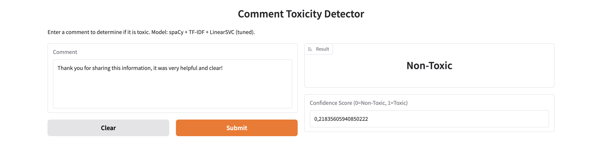

# Toxicity Detector for Social Media Comments

## Overview

This project is focused on developing a system for detecting toxic comments using Natural Language Processing (NLP). The system preprocesses input text, classifies it as "Toxic" or "Non-Toxic" using a trained model, and provides access to this functionality via a web API and a simple web interface.

## Features

* Text preprocessing pipeline using spaCy (lemmatization, stopword removal, cleaning).
* Text vectorization using TF-IDF.
* Classification model based on LinearSVC trained on the Jigsaw Toxicity dataset.
* Hyperparameter tuning using RandomizedSearchCV to optimize the model pipeline.
* RESTful API built with FastAPI to serve predictions.
* Simple interactive web UI built with Gradio for easy testing and demonstration.

## Technology Stack

* **Language:** Python 3
* **NLP:** spaCy
* **ML & Data:** scikit-learn, pandas, numpy, joblib, scipy
* **API:** FastAPI, Uvicorn
* **UI:** Gradio
* **Environment:** venv

## Project Structure

```
Toxic_Comment_Analysis/
├── .venv/                     # Virtual environment folder
├── api/                       # API code and dependencies
│   ├── main.py                # FastAPI application with Gradio UI mounted
│   └── requirements.txt       # API dependencies
├── data/                      # Input data
│   └── data.csv               # Dataset (e.g., renamed train.csv from Jigsaw)
├── notebooks/                 # Jupyter notebooks for development
│   └── Toxic_Comment_Analysis.ipynb # Main notebook for training & tuning
├── saved_pipeline_spacy_svm/  # Saved optimized ML pipeline
│   └── best_toxicity_pipeline.joblib
└── README.md                  # This file
```

## Dataset

The model was trained and evaluated using data derived from the [Jigsaw Toxic Comment Classification Challenge](https://www.kaggle.com/competitions/jigsaw-toxic-comment-classification-challenge/data) dataset available on Kaggle. The specific data used for training should be placed in the `data/` folder, named `data.csv`.

## Setup

Follow these steps to set up the project environment:

1.  **Prerequisites:**
    * Python 3.8+ installed.
    * `pip` package installer.

2.  **Clone Repository (if applicable) or Download Project Files:**
    ```bash
    # If it's a git repo:
    # git clone <repository_url>
    # cd DIPLOMA
    # Otherwise, ensure you have the project folder structure locally.
    ```

3.  **Create and Activate Virtual Environment (Recommended):**
    Navigate to the project root directory (`Toxic_Comment_Analysis/`) in your terminal and run:
    ```bash
    # Create virtual environment
    python3 -m venv .venv
    # Activate virtual environment
    # On macOS/Linux:
    source .venv/bin/activate
    # On Windows:
    # .venv\Scripts\activate
    ```

4.  **Install Dependencies:**
    Install the necessary Python packages listed in the API's requirements file:
    ```bash
    pip install -r api/requirements.txt
    ```
    *(Ensure the versions in `api/requirements.txt`, especially for `scikit-learn` and `spacy`, match the environment used for training the saved pipeline).*

5.  **Download spaCy Language Model:**
    Download the English language model used for preprocessing:
    ```bash
    python -m spacy download en_core_web_sm
    ```

## Usage

There are two main parts to this project: running the model training/tuning notebook and running the API/UI service.

### 1. Model Training & Tuning (Jupyter Notebook)

* Ensure your virtual environment is activated.
* Start Jupyter Notebook or Jupyter Lab from your project root directory:
    ```bash
    jupyter lab
    # or
    # jupyter notebook
    ```
* Navigate to the `notebooks/` folder in the Jupyter interface and open `Toxic_Comment_Analysis.ipynb`.
* Run the cells sequentially. This notebook covers:
    * Data loading (`data/data.csv`).
    * Text preprocessing using spaCy.
    * Splitting data into training and testing sets.
    * Setting up and running `RandomizedSearchCV` for hyperparameter tuning of the TF-IDF + LinearSVC pipeline. 
    * Evaluating the best found pipeline on the test set.
    * Saving the optimized pipeline to `saved_pipeline_spacy_svm/best_toxicity_pipeline.joblib`.
* You generally only need to run this notebook if you want to retrain the model or experiment with different parameters/models. The pre-trained pipeline is already saved.

### 2. Running the API & UI

* Ensure your virtual environment is activated.
* Make sure you are in the **root directory** of the project (`DIPLOMA/`) in your terminal.
* Run the Uvicorn server:
    ```bash
    uvicorn api.main:app --reload --host 0.0.0.0 --port 8000
    ```
    * `--reload` enables auto-reload on code changes (useful for development).
* The API and UI will be available at the following URLs:
    * **API Docs (Swagger UI):** [http://127.0.0.1:8000/docs](http://127.0.0.1:8000/docs)
    * **Web UI (Gradio):** [http://127.0.0.1:8000/ui](http://127.0.0.1:8000/ui)
* You can interact with the model either programmatically via the API (using tools like `curl` or Python's `requests`) or visually using the Gradio web interface.
* To stop the server, press `Ctrl+C` in the terminal where `uvicorn` is running.

### 3. Screenshots

Here are a few screenshots demonstrating the running application:

**1. Gradio Web Interface (`/ui`)**

*Example of classifying a non-toxic comment:*



*Example of classifying a toxic comment:*


## Results

The final model is a pipeline combining TF-IDF vectorization and a LinearSVC classifier, optimized using `RandomizedSearchCV`. The performance achieved on the test set (using ROC AUC score) is reported in the evaluation step of the Jupyter Notebook (e.g., `~0.965`).


